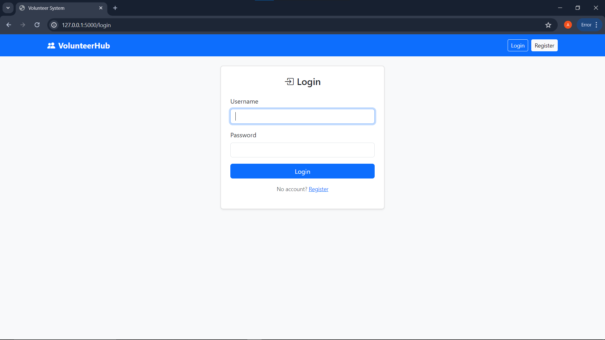
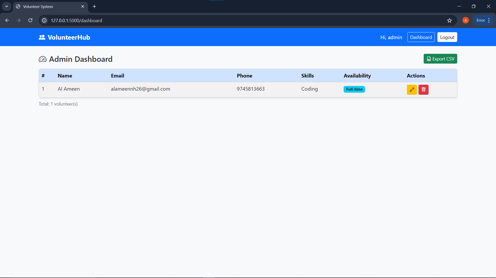

# VolunteerHub

A Volunteer Registration System built using Flask, SQLite, HTML, CSS, and Bootstrap.

## Features
- User Registration
- Login Authentication
- Volunteer Registration Form
- Admin Dashboard
- Report Generation

## Tech Stack
- Python
- Flask
- SQLite
- SQLAlchemy
- Bootstrap

## Run Locally

pip install -r requirements.txt
python app.py

## Screenshots

### Login Page

### Registration Page

### Admin Dashboard

### Volunteer Form

